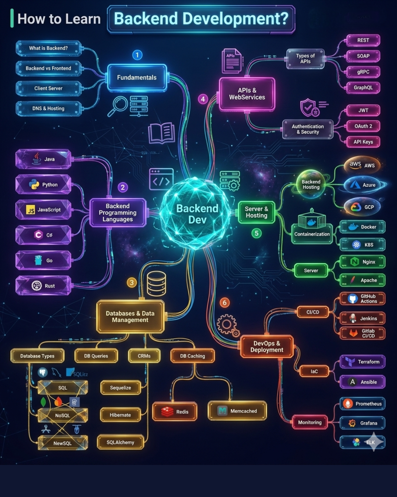

# LIBRARY OF LINKS AND TOOLS FOR DEVELOPERS

Repositório dedicado a armazenar e organizar os links e ferramentos de diversos assuntos que são de grande importância para construção e manutenção da carreira de sucesso como **`Desenvolvedor de Software Profissional`**. Portanto, todo o Desenvolvedor, não importa o seu nível ou momente de carreira, deveria conhecer porque tenho certeza que você encontrará no mesmo,  recursos incríveis que  você iria gostar de conhecer bem antes.

---

### 💡 INTRODUCTION
🎓 Em 2025, você não precisa de um diploma para aprender `IA` ou qualquer outra coisa que você queria aprender - tudo vai depender da sua determinação em fazer acontecer.
O futuro do mercado de trabalho vai depender mais de habilidades IA do que certificações e diplomas, dito pelos maiores da IA Generativa, portanto faça sua parte e saia na frente.
Eu encontrei inumeros cursos gratuitos de diversas empresas gigantes para acelerar sua jornada e você não precisa perder tempo procurando em outro lugar. Você tem está tudo aqui 👇

## 🚀 BEST SOFT. DEVELOPMENT TRAINNING COMPANIES YOU SHOULD KNOW [FREE]

1 - [Welcome to freeCodeCamp's curriculum](https://www.freecodecamp.org/learn/)  |  freeCodeCamp

## 🚀 FERRAMENTAS DE USO GERAL
1.  [Tools PDF24](https://tools.pdf24.org/pt/) | Ferramentas online de PDF gratuitas e fáceis de usar que aumentam sua produtividade.
2.  [I Love PDF](https://www.ilovepdf.com/pt) | Ferramentas online para os amantes de PDF
3. 

## 🚀 COURSES LINKS

#### 📚 Cursos de Inteligência Artificial direto da fonte criadora

🔶 Anthropic → [Anthropic Skill Jar](https://anthropic.skilljar.com/)

🔶 Anthropic → [Anthropic Acadamy](https://www.anthropic.com/learn)

🔵 Google → https://grow.google/ai-coursera/

🔵 Meta → https://ai.meta.com/resources/

🟢 NVIDIA → https://developer.nvidia.com/cuda

🟥 Microsoft → https://learn.microsoft.com/pt-br/training/

⚫ OpenAI → https://academy.openai.com/

🔵 IBM → https://skillsbuild.org/

🟠 AWS → https://skillbuilder.aws/

🔴 DeepLearning.AI → https://deeplearning.ai/

🟡 Abraçando o rosto → https://huggingface.co/learn/

#### 📚 Cursos Gerais de TIC

1. [CS50x: Introduction to Computer Science](https://www.harvardonline.harvard.edu/course/cs50-introduction-computer-science) | Harvard University
2. [CC50: o curso gratuito de Introdução a Ciência da Computação de Harvard no Brasil](https://www.estudarfora.org.br/cc50-v2/) | Harvard University
3. [Introduction to Computer Science and Programming in Python](https://ocw.mit.edu/courses/6-0001-introduction-to-computer-science-and-programming-in-python-fall-2016/) | MIT OpenCourseWare
4. [Curso Santander | Domine a IA com prompting responsável](https://www.santanderopenacademy.com/pt_br/courses/master-ai-with-responsible-prompting.html/index.html?utm_source=google&utm_medium=performance-max&utm_campaign=saz-awar-instu-niver-25|pf|awar|perf-max|marca|cpa|na|snt|publicidade|na&utm_content=domine-ia-pmax|marca|na|preditiva-domine-ia|performance-max|lepub|performance-max|m18896-32120-16&utm_mmm=:m18896-g32120-p32120[t506-f548]17697:&utm_adid=m18896-32120-16&utm_publisher_id=&utm_id=&gad_source=1&gad_campaignid=22288353085&gbraid=0AAAAA-18uor4Ih_d3DNEkoaELXBiIrCeK&gclid=Cj0KCQjw4qHEBhCDARIsALYKFNMuxkUUzDDTuY0zCNYcVsmiJMW51en0ewjfjdgzuwGcwwn5BVBaX0MaAsU2EALw_wcB) | Santander Open Academy
5. [Inteligência Artificial Generativa](https://www.escolavirtual.gov.br/curso/1091) | Escola Virtual GOV
6. [Especialização em Fundamentos de IA do Google](https://www.coursera.org/specializations/ai-essentials-google/paidmedia?utm_medium=sem&utm_source=gg&utm_campaign=b2c_latam_google-ai-essentials_google_ftcof_learn_px_dr_bau_gg_sem_pr_br_pt_m_hyb_25-07_x&campaignid=22771272682&adgroupid=179960896697&device=c&keyword=curso%20de%20ia&matchtype=b&network=g&devicemodel=&creativeid=762612059481&assetgroupid=&targetid=kwd-336414206545&extensionid=&placement=&gad_source=1&gad_campaignid=22771272682&gbraid=0AAAAADdKX6a5fzevpCdJQRzS47rqjVg-D&gclid=Cj0KCQjw4qHEBhCDARIsALYKFNPdn0zyqAYy3OsgiKOtAXbUqaMIFXanpT5Rq0TnChPRbAomJP3w3twaAg1lEALw_wcB) | Curso da Google na plataforma Coursera
7. [Introdução à IA generativa](https://www.cloudskillsboost.google/course_templates/536?locale=pt_BR) | Curso rápido da Google com Badge de conclusão
8. [Inteligência Artificial e o Novo Contexto da Cultura Digital](https://www.ev.org.br/cursos/inteligencia-artificial-e-o-novo-contexto-da-cultura-digital) | fundação bradesco | escola virtual
9. [Curso Santander | Google: Inteligência Artificial e Produtividade](https://www.santanderopenacademy.com/pt_br/courses/google-artificial-intelligence-and-productivity.html/index.html?utm_source=google&utm_medium=performance-max&utm_campaign=saz-awar-instu-niver-25|pf|awar|perf-max|marca|cpa|na|snt|publicidade|na&utm_content=produtividade-ia-pmax|marca|na|preditiva-produtividade-ia|performance-max|lepub|performance-max|m18896-32120-20&utm_mmm=:m18896-g32120-p32120[t506-f548]17697:&utm_adid=m18896-32120-20&utm_publisher_id=&utm_id=&gad_source=1&gad_campaignid=22288353085&gbraid=0AAAAA-18uor4Ih_d3DNEkoaELXBiIrCeK&gclid=Cj0KCQjw4qHEBhCDARIsALYKFNMhlkRX-3EI8-unvUjdc9JaLVsS2w-BCfP2ZTISaXJOsGLUkDqHIewaAt9zEALw_wcB)  |  Santander Open Academy
10. [Cursos gratuitos da USP na Coursera](https://www.coursera.org/partners/usp) |  Coursera.org
11. [Google Cloud Fundamentals: Core Infrastructure](https://www.coursera.org/learn/gcp-fundamentals?action=enroll)  |  Coursera.org
12. [Machine Learning Operations (MLOps): Getting Started - Português Brasileiro](https://www.coursera.org/learn/mlops-fundamentals-br)   |  Coursera.org
13. [Cursos de IA da Microsoft](https://lnkd.in/d3MkAmuM)
14. [Cursos de IA do Google](https://lnkd.in/d-xihRua)
15. [Engenharia de Prompts ChatGPT (Universidade Vanderbilt)](https://lnkd.in/dHTiW7hV)
16. [Introdução à IA com Python (Universidade de Harvard)](https://lnkd.in/dwDk9yZr)
17. [Big Data, IA e Ética (UC Davis)](https://lnkd.in/dAJfNXvk)
18. [Engenharia de Prompts para Desenvolvedores (OpenAI)](https://lnkd.in/dQYPq8ua)
19. [Aplicações de IA e Engenharia de Prompts (edX)](https://lnkd.in/dE9GEpTK)
20. [Fundamentos da Engenharia Prompta (AWS)](https://lnkd.in/dYuWfZAv)
21. [IA Generativa para Todos (DeepLearning.AI)](https://lnkd.in/deYvKjw5)
22. [Cursos de IA Generativa (LinkedIn Learning)](https://lnkd.in/du8Rhbi6)

#### 📚 Agentes de Inteligência Artificial

1. [Melhoria da Precisão das Aplicações de LLM](https://lnkd.in/dm5S3FFy)
2. [Desenvolver agentes de IA no Azure](https://lnkd.in/d7F6nB88)
3. [Liberando o Poder dos Agentes de IA](https://lnkd.in/d6igwdqD)
4. [IA Agentica e Agentes de IA: Um Guia para Líderes](https://lnkd.in/dk8eJdDH)
5. [Memória Agentica de Longo Prazo com LangGraph](https://lnkd.in/dY4Jcwnq)
6. [Criar Aplicativos de IA Generativa no Google Cloud](https://lnkd.in/dXugBwUP)
7. [Construção de Agentes RAG com LLMs](https://lnkd.in/dkJjAWAH)
8. [IA Agente](https://lnkd.in/dUbi8bAa)

#### 📚 Google Cloud:

1. [Introdução à IA generativa](https://lnkd.in/dbnBXPYq)  | (⏱ 45min)
2. [Design de prompt em Vertex AI](https://lnkd.in/ebH8RhEr) | (⏱ 3h 45min)
3. [Introdução ao Duet AI no Google Workspace](https://lnkd.in/gpd_CcTs) | (⏱ 15 min)
4. [IA responsável: aplicando os princípios de IA com o Google Cloud](https://lnkd.in/dfj2EvhF) | (⏱ 2 horas)
5. [IA conversacional no Vertex AI e no Dialogflow CX](https://lnkd.in/dhVKVsrg) | (⏱ 5 horas)
6. [Mecanismo de atenção](https://lnkd.in/de6V9dGq) | (⏱ 30 min)
7. [Criar modelos de legendas de imagem](https://lnkd.in/dQYqif7T) | (⏱ 30 min)
8. [Arquitetura do codificador-decodificador](https://lnkd.in/dECQGCEU) | (⏱ 30 horas)
9. [Pipelines de ML no Google Cloud](https://lnkd.in/gN3PSDi5) | (⏱ 13 horas e 15 minutos)
10. [Google Cloud Solutions II: Dados e Machine Learning](https://lnkd.in/gfDcXfKh) | (⏱ 4 horas)

#### 📚 Microsoft:

11. [Fundamentos da IA generativa](https://lnkd.in/gvYEj9at) | (⏱ 36 minutos)
12. [Fundamentos de Aprendizado de Máquina](https://lnkd.in/ext-G-ch) | (⏱ 1 hora e 54 min)
13. [Fundamentos do Azure OpenAI Service](https://lnkd.in/eZ23ve2Z) | (⏱ 1 hora e 3 minutos)
14. [Fundamentos de Visão Computacional](https://lnkd.in/dS-dFKBv) | (⏱ 52 min)
15. [Implantar e consumir modelos com aprendizado de máquina](https://lnkd.in/djKtE-ki) | (⏱ 1 hora e 29 minutos)
16. [Criar bots com o Microsoft Bot Framework](https://lnkd.in/d4ga-W8n) | (⏱ 57 min)
17. [Fundamentos da compreensão da linguagem de conversação](https://lnkd.in/d5fzzb_a) | (⏱ 42 min)
18. [Fundamentos da IA Generativa Responsável](https://lnkd.in/dqjnzcCD) | (⏱ 3 h 15 min)
19. [Desenvolver solução de IA generativa com o Azure OpenAI Service](https://lnkd.in/gg8Qe8Sq) | (⏱ 2 horas)
20. [Projetando e implementando uma solução de IA do Azure](https://lnkd.in/dbPbCWaK) | (⏱ 4 dias)

👉 Todos gratuitos. Todos acessíveis. 
🚨 Esses cursos são um excelente ponto de partida para você dominar a inteligência artificial — mesmo sem experiência prévia.

  
### 📚 Cursos Online Gratuitos de InteligênciaArtificial de Harvard

A Universidade de Harvard oferece diversos cursos gratuitos online, cobrindo áreas como Inteligência Artificial (IA), Programação, Ciência da Computação e Ciência de Dados. Abaixo está a lista com links diretos para você acessar cada curso.

`Cursos Gratuitos de Inteligência Artificial`

Esses cursos oferecem uma introdução prática e teórica à IA, ideais para iniciantes e níveis intermediários.

🦾 [CS50's Introdução à Inteligência Artificial com Python](https://lnkd.in/dSxJFXwA) | Nível: Intermediário. Certificado: Disponível após conclusão.

🦾 [Data Science: Machine Learning](https://lnkd.in/dBMJX9RP) | Nível: Intermediário. Certificado: Disponível após conclusão.

🦾 [Introdução à Programação com Python](https://lnkd.in/dxwvMx-x) |  Nível: Iniciante. Certificado: Disponível após conclusão.

🦾 [IA Responsável: Princípios de IA com Google Cloud](https://lnkd.in/dkTnrA_e) | Nível: Intermediário. Certificado: Disponível após conclusão.

🦾 [CS50's Introdução à Ciência da Computação](https://lnkd.in/dVSaV7xR) | Nível: Iniciante. Certificado: Disponível após conclusão.

`Cursos Gratuitos de Programação`

Para quem deseja aprender programação ou aprimorar habilidades existentes.

🦾 [CS50's Introdução à Programação com Scratch](https://lnkd.in/dDy3hqvB) | Nível: Iniciante. Certificado: Disponível após conclusão.

🦾 [CS50's Programação Web com Python e JavaScript](https://lnkd.in/d9aun5Xw) | Nível: Intermediário. Certificado: Disponível após conclusão.

🦾 [CS50's Desenvolvimento de Apps Móveis com React Native](https://lnkd.in/dDnedDe6) | Nível: Intermediário. Certificado: Disponível após conclusão.

🦾 [CS50's Compreendendo Tecnologia](https://lnkd.in/dNQRH4wU) | Nível: Iniciante. Certificado: Disponível após conclusão.

🦾 [CS50's Ciência da Computação para Negócios](https://lnkd.in/ddmMq--w) | Nível: Iniciante. Certificado: Disponível após conclusão.

`Cursos Gratuitos de Ciência de Dados`

Focados em técnicas e práticas de análise de dados.

🦾 [Data Science: Machine Learning](https://lnkd.in/dBMJX9RP)
🦾 [Data Science: Visualização](https://lnkd.in/dBpFdAFr)
🦾 [Data Science: Probabilidade](https://lnkd.in/dn4_SepG)
🦾 [Data Science: R Basics](https://lnkd.in/dg9meS8V)
🦾 [Data Science: Inferência Estatística](https://lnkd.in/d62NGgSH)

## 🚀 WEBSITES (PLATFORMS)

- [Plataforma Curso em Vídeo](https://www.cursoemvideo.com/cursos/)  |  Curso em Vídeo
- [Conheça diversos cursos interessantes da escola virtual](https://www.ev.org.br/cursos) | fundação bradesco | escola virtual
- [Diversos cursos do MIT no edX](https://www.edx.org/school/mitx) | MITx on edX
- [Plataforma Aprenda mais](https://aprendamais.mec.gov.br/?redirect=0)  |  MEC GOV.BR
- [Plograma de Desenvolvimento Inicial](https://aprendamais.mec.gov.br/?redirect=0)  |  Escola Virtual GOV
- [Conheça inumeros cursos do Santander Open Academy](https://www.santanderopenacademy.com/pt_br/index.html?utm_source=google&utm_medium=performance-max&utm_campaign=saz-awar-instu-niver-25%7Cpf%7Cawar%7Cperf-max%7Cmarca%7Ccpa%7Cna%7Csnt%7Cpublicidade%7Cna) | Santander Open Academy
- [Aprenda Sem Limites (diversos cursos)](https://www.coursera.org/)  | Coursera.org
- [Aprenda e se capacite com Diveros Cursos da European Union](https://academy.europa.eu/courses/?ctype=topics)  |  eu|academy

## 🚀 VACANCIES (VAGAS DE EMPREGO) | 💰 PLATAFORMAS DE FREELANCER

- [Turing Careers](https://careers.turing.com/)
- [DataScience Jobs Canada](https://www.datasciencejobscanada.com/)
- [BairesDev](https://talent.bairesdev.com/?_gl=1*1t2q9mv*_ga*MTA2Nzk1Mjk4NC4xNzUzOTc0NDAy*_ga_YEM7K5XJ0C*czE3NTM5NzQ0MDEkbzEkZzEkdDE3NTM5NzQ4NjUkajUwJGwwJGgw) 
- [Remote OK](https://remoteok.com/) | Focado em vagas de trabalho 100% remotas de médio e longo prazo

 
 `No Brasil`
    
  - [99Freelas](https://www.99freelas.com.br/) | É uma plataforma popular no Brasil com muitas oportunidades em desenvolvimento web, mobile, sistemas, etc.
  - [Workana](https://www.workana.com/pt/) | Ampla variedade de projetos de TI e programação, sendo uma das maiores na América Latina. Você encontrará projetos de desenvolvimento web, mobile, e-commerce, entre outros.
  - [Trampos.co](https://trampos.co/) | Embora não seja exclusivamente freelancer, muitas vagas aqui são para tecnologia, incluindo desenvolvimento, e há uma boa parte de oportunidades remotas ou PJ que se assemelham a trabalhos freelancers.
  - [GetNinjas](https://www.getninjas.com.br/) | Embora seja mais generalista, permite encontrar projetos de desenvolvimento web, criação de apps e outros serviços de TI.
  - [LinkedIn](https://br.linkedin.com/) | Muitas empresas e startups no Brasil utilizam o LinkedIn para buscar desenvolvedores freelancers ou para projetos pontuais. É ótimo para networking e para encontrar oportunidades diretas.

`No Exterior (com foco em ganhos em dólar/euro)`
  - [Upwork](https://www.upwork.com/) | É uma das maiores plataformas globais e tem uma quantidade enorme de projetos de programação de todos os tipos (web, mobile, backend, frontend, data science, etc.).
  - [Toptal](https://www.toptal.com/) | Altamente seletiva, focada nos melhores 3% dos talentos em desenvolvimento, design e finanças. Se você é um programador sênior e experiente, essa é uma ótima opção para projetos de alto nível e bem remunerados.
  - [Fiverr](https://www.fiverr.com/) | Ótimo para programadores que querem oferecer "gigs" (serviços pré-definidos) para tarefas específicas, como criação de scripts, pequenos desenvolvimentos, automações, etc.
  - [Freelancer.com](https://www.freelancer.com/) | Assim como o Upwork, é uma plataforma global com uma vasta gama de projetos de programação.
  - [Arc.dev](https://arc.dev/) | Uma plataforma que conecta desenvolvedores remotos de elite com empresas. Passa por um rigoroso processo de seleção.
  - [PeoplePerHour](https://www.peopleperhour.com/) | Oferece projetos de desenvolvimento de software, web e mobile, entre outras categorias.
  - [Guru](https://www.guru.com/) | Possui uma seção robusta para desenvolvedores e profissionais de TI, com opções de projetos por hora ou por trabalho.
  - [Flexjobs](https://www.flexjobs.com/) | Focada em vagas remotas e flexíveis, muitas das quais são para desenvolvedores. É uma plataforma paga, mas com curadoria das vagas, o que pode valer a pena.
  - [Codeable](https://codeable.io/) | Especializada em desenvolvedores WordPress. Se você é um especialista em WordPress, essa é uma excelente opção.
  - [Gun.io](https://www.gun.io/) | Focada em conectar talentos de engenharia de software de alto nível com empresas.

## 🚀 27 sites melhores para receber em dólares americanos de qualquer lugar

1. [Feedcoyote](https://feedcoyote.com) | Trabalhos freelance pagos exclusivamente em dólares americanos. Perfeito para freelancers globais.
2. [JustRemote](https://justremote.co) | Trabalhos remotos e híbridos das principais empresas do mundo.
3. [Himalayas](https://himalayas.app) | Interface moderna com insights salariais para trabalhos remotos em tecnologia.
4. [Wellfound](https://wellfound.com) | Principal quadro de vagas para startups e talentos globais de tecnologia.
5. [Working Nomads](https://workingnomads.com) | Trabalhos remotos selecionados para nômades digitais.
6. [Job Board Search](https://jobboardsearch.com) | Pesquisa em mais de 350 quadros de empregos em um só lugar.
7. [Remotive](https://remotive.io) | Comunidade e listagens confiáveis de empregos remotos.
8. [We Work Remotely](https://weworkremotely.com) | Plataforma tradicional para vagas em empresas remotas.
9. [Remote OK](https://remoteok.com) | Empregos remotos em startups, tecnologia e design.
10. [FlexJobs](https://flexjobs.com) | Funções remotas e híbridas verificadas, sem fraudes.
11. [Remote.co](https://remote.co) | Listas de empregos remotos selecionadas em diversos setores.
12. [EuropeRemotely](https://europeremotely.com) | Empregos remotos abertos a candidatos fora dos EUA.
13. [Jobspresso](https://jobspresso.co) | Trabalhos remotos escolhidos a dedo em marketing, tecnologia e design.
14. [Working In Content](https://lnkd.in/gNaa6R-N) | Plataforma voltada para escritores, editores e estrategistas de conteúdo.
15. [PowerToFly](https://powertofly.com) | Conecta mulheres a empresas com vagas remotas.
16. [Virtual Vocations](https://lnkd.in/gUkycegk) | Trabalhos remotos e de teletrabalho verificados manualmente.
17. [Dynamite Jobs](https://dynamitejobs.com) | Trabalhos remotos em startups e empresas independentes.
18. [Authentic Jobs](https://authenticjobs.com) | Excelente para desenvolvedores, designers e profissionais criativos.
19. [Remote Rocketship](https://lnkd.in/gdJFY2bn) | Trabalhos de tecnologia remota atualizados diariamente.
20. [NoDesk](https://nodesk.co) | Recursos e listas de empregos para a cultura de trabalho remoto.
21. [Outsourcely](https://outsourcely.com) | Trabalhos remotos de longo prazo para freelancers e startups.
22. [Arc.dev](https://arc.dev) | Trabalhos remotos em software para empresas aprovadas.
23. [Turing](https://turing.com) | Conecta profissionais a empregos remotos de tecnologia nos EUA.
24. [Lemon.io](https://lemon.io) | Marketplace freelance que conecta desenvolvedores a startups.
25. [Contra](https://contra.com) | Plataforma freelance sem comissão para profissionais criativos.
26. [Remotees](https://remotees.com) | Mais de 1.000 trabalhos remotos atualizados diariamente.
27. [SkipTheDrive](https://www.skipthedrive.com/) | Simplifica a busca por empregos remotos com listagens verificadas.

## 🚀 50 Sites de Trabalho Remoto para Ganhar em USD

Então eu compilei os melhores sites de empregos remotos para você.
1. [SolidGigs](https://solidgigs.com) | Isso ajuda a agilizar sua busca por emprego. Uma taxa mensal de associação te dá acesso a uma enorme biblioteca de recursos com cursos, entrevistas, modelos, roteiros e outras ferramentas, tudo com o foco de ajudar você a conseguir mais empregos freelancers.
2. [JustRemote](https://justremote.co) | A plataforma deles foi criada especificamente para que as pessoas descubram as melhores oportunidades de trabalho remoto ao redor do mundo, sem foco em uma localização ou região específica
3. [Empregos Dinamites](https://dynamitejobs.com/) | Mais de 100+ empregos remotos de qualidade são adicionados toda semana à plataforma — e buscar o que você deseja é personalizável com a variedade de filtros e funcionalidades do site.
4. [Remotivação](https://remotive.com/) | Você pode pesquisar em todas as categorias, incluindo marketing. É fácil perceber quando uma vaga foi anunciada, onde ela está localizada e em qual especialidade ela pertence.
5. [Bem encontrado](https://wellfound.com/) | Ótimos recursos deste site de empregos remotos incluem discrição e transparência salarial.
6. [A Musa](https://www.themuse.com/) | Ele permite que os usuários filtrem vagas remotas e oferece recursos como coaching de carreira e perfis de empresas para ajudá-los a conseguir o emprego.
7. [Toptal](https://www.toptal.com/) | O foco principal da Toptal é colocar freelancers talentosos em empregos remotos trabalhando para clientes como Shopify e Thumbtack.
8. [Workew](https://workew.com/) | Você pode marcar nos favoritos vagas remotas específicas que parecem atraentes enquanto navega, e até se inscrever nas notificações do Twitter para ser alertado assim que um novo emprego remoto for lançado.
9. [Himalaias](https://himalayas.app/) | Possui um filtro poderoso de visto e fuso horário que facilita encontrar os empregos remotos mais cuidadosamente selecionados.
10. [Jooble](https://jooble.org) | Uma plataforma global de emprego que opera em mais de 60 países, conectando candidatos a uma vasta gama de oportunidades de mais de 140.000 fontes diversas.
11. [Upwork](https://www.upwork.com/) | Trabalhos freelancer em diversas áreas.
12. [Fiverr](https://www.fiverr.com/) | Oferece serviços em diversas categorias.
13. [Freelancer](https://www.freelancer.com/) | Licite em projetos e gigs.
14. [Toptal](https://www.toptal.com/) | Freelancers altamente qualificados.
15. [Guru](https://www.guru.com/) | Conecte-se com clientes para trabalhos.
16. [PeoplePerHour](https://www.peopleperhour.com/) | Encontre trabalhos e gigs freelancer.
17. [SimplyHired](https://www.simplyhired.com/) | Job search engine para trabalho remoto.
18. [FlexJobs](https://www.flexjobs.com/) | Listagem de trabalhos remotos curados e flexíveis.
19. [We Work Remotely](https://weworkremotely.com/) | Listagem de trabalhos remotos por cargo, nicho, entre outros.
20. [Remote.co](https://remote.co/) | Listagem de oportunidades e conselhos sobre trabalho remoto.
21. [AngelList / Wellfound](https://wellfound.com/) | Startups oferecendo vagas remotas.
22. [LinkedIn Jobs](https://www.linkedin.com/jobs/) | Rede e listagem de empregos remotos.
23. [Indeed](https://www.indeed.com/) | Empresa com vagas remotas e listagens de emprego.
24. [Glassdoor](https://www.glassdoor.com/) | Pesquise por empregos remotos.
25. [Turing](https://www.turing.com/jobs) | Especializa-se em empregos remotos.
26. [JustRemote](https://justremote.co/) | Listagens de vagas remotas.
27. [SolidGigs](https://solidgigs.com/) | Recursos focados em freelancers de alta renda.
28. [Contena](https://contena.co/) | Blogging, redação e sites de trabalho remoto.
29. [Working Nomads](https://www.workingnomads.com/jobs) | Listagens de trabalho remoto.
30. [Outsourcely](https://www.outsourcely.com/) | Contrate projetos e freelancers remotos.
31. [DesignCrowd](https://www.designcrowd.com/) | Projetos de design para freelancers.
32. [Simply Law Jobs](https://www.simplylawjobs.com/) | Oportunidades remotas na área jurídica.
33. [Remote Jobs Club](https://remotejobsclub.com/) | Boletim informativo com listas de emprego remoto.
34. [Reddit forhire](https://www.reddit.com/r/forhire/) | Subreddit com listagens de trabalho remoto.
35. [Virtual Vocations](https://www.virtualvocations.com/) | Listagens e recursos de trabalho remoto.
36. [Crowded](https://www.crowded.com/) | Agregador de vagas e oportunidades remotas.
37. [TaskRabbit](https://www.taskrabbit.com/) | Tarefas e gigs de serviços.
38. [PeoplePerHour](https://www.peopleperhour.com/) | Serviços freelancer e gigs.
39. [Clickworker](https://www.clickworker.com/) | Microtarefas e tarefas curtas.
40. [Amazon Mechanical Turk](https://www.mturk.com/) | Microtarefas e coleta de dados.
41. [Appen](https://appen.com/) | Crowdsourcing de idioma e projetos remotos.
42. [Unbabel](https://unbabel.com/) | Trabalho com linguagem e IA.
43. [LanguageLine Solutions](https://www.languageline.com/careers) | Tradução e interpretação remota.
44. [TranscribeMe](https://www.transcribeme.com/) | Trabalho remoto com transcrição.
45. [Writing.com](https://writing.com/) | Blogging e redação freelancer.
46. [Jobscribe](https://jobscribe.com/) | Curadoria de listas de empregos remotos.
47. [Hubstaff Talent](https://talent.hubstaff.com/) | Base de empregos de empresas.
48. [Jobs2Careers](https://www.jobs2careers.com/) | Conteúdos e oportunidades de trabalho remoto.
49. [Keyword Studios Careers](https://www.keywordstudios.com/careers/) | Listagens e projetos remotos.
50. [Outsourcely](https://www.outsourcely.com/) | Plataformas remotas e freelancers remotos.

## 📌 Como aprender Backend Development?

Desenvolvimento backend envolve diversas áreas de conhecimento! Aqui está um mapa mental com os principais tópicos que um desenvolvedor backend deve aprender:

 1️⃣ Fundamentos – Compreender o que é backend, a diferença entre frontend e backend, arquitetura cliente-servidor, DNS e hospedagem.
 
 2️⃣ Linguagens de Programação – Escolha entre Java, Python, JavaScript, Go, Rust ou C#.
 
 3️⃣ Bancos de Dados e Gerenciamento de Dados – Aprenda sobre SQL (PostgreSQL, MySQL, SQLite), NoSQL (MongoDB, Firebase, DynamoDB), NewSQL, ORMs e caching com Redis e Memcached.
 
 4️⃣ APIs e Web Services – Entenda os tipos de APIs (REST, GraphQL, gRPC, SOAP) e métodos de autenticação como JWT, OAuth 2 e API Keys.
 
 5️⃣ Servidores e Hospedagem – Explore serviços como AWS, Azure e GCP, além de containerização com Docker e Kubernetes, e servidores como Nginx e Apache.
 
 6️⃣ DevOps e Deploy – Conheça CI/CD (GitHub Actions, Jenkins), Infraestrutura como Código (Terraform, Ansible) e ferramentas de monitoramento como Prometheus, Grafana e ELK.

  

🛠️ Backend é uma área ampla e cheia de possibilidades! Qual desses tópicos você já domina e quais ainda quer aprender?

## 🚀 IMPORTANT LINKS

- [7 APIs Públicas Grátis para Desenvolvedores](https://mgcconsulting.com.br/7-apis-publicas-gratis-para-desenvolvedores/)
- [How to use the Extends and Include Django Template Tags](https://ordinarycoders.com/blog/article/extend-and-include-django-template-tags)
- [Conheça 70 termos em inglês usados no mundo dos negócios!](https://www.berlitz.com/pt-br/blog/conheca-70-termos-em-ingles-usados-no-mundo-dos-negocios)
- [SKILL ICONS VIEW](https://skillicons.dev/)
- [SKILL ICONS DEV](https://github.com/tandpfun/skill-icons#readme)
- [FIX MODULENOTFOUNDERROR](https://www.youtube.com/watch?v=Ad-inC3mJfU)

## 🚀 LINKEDIN PROFILES YOU SHOULD KNOW

- [Trampar na Gringa](https://www.linkedin.com/company/tramparnagringa/posts/?feedView=all) | Consulturia de preparação para conseguir vagas no exterior.
- [Home Office - Vagas Remotas](https://www.linkedin.com/company/home-office-vagas-remotas/posts/?feedView=all) | Acompanham todos os dias as principais oportunidades de trabalho Home Office e Híbridas no Brasil para compartilhar.
- [Quero Home - Vagas Remotas](https://www.linkedin.com/company/quero-home/) | As melhores vagas Home Office e Híbridas!
- [Remotar](https://www.linkedin.com/company/remotar-jobs/posts/?feedView=all) |  eu remoto, tu remotas
- [Vagas Remotas](https://www.linkedin.com/company/vagas-remotas-net/posts/?feedView=all) | Acompanhe aqui as notícias de empresas contratando! Somos um portal de notícias, leiam nossas matérias 😉

## 🚀 CERTIFICATES LINKS

- [BIBLIOTECA DE TREINAMENTO PARA CERTIFICAÇÕES DE AWS](https://www.aws.training/LearningLibrary)  | AWS Training ans Certification
- [AWS Certification](https://aws.amazon.com/pt/certification/?ams%23interactive-card-vertical%23pattern-data-919416334.filter=%257B%2522filters%2522%253A%255B%255D%257D&ams%23interactive-card-vertical%23pattern-data--569888661.filter=%257B%2522filters%2522%253A%255B%255D%257D&ams%23interactive-card-vertical%23pattern-data--1110278974.filter=%257B%2522filters%2522%253A%255B%255D%257D&ams%23interactive-card-vertical%23pattern-data-1727125239.filter=%257B%2522filters%2522%253A%255B%255D%257D) | Valide seus conhecimentos técnicos e experiência com a nuvem para crescer na carreira e nos negócios

## 🚀 ENGLISH PROFICIENCE TEST PLATFORMS

- [Teste Gratuito de Proficiência em Inglês](https://www.ef.com.br/certificados-ingles/efset/) | EF SET
  
## 🚀 YOUTUBE CHANNELS 

De acordo com o Copilot, para pesquisa realizada em 31/07/2025, a seguir está uma seleção dos **10 melhores canais brasileiros** e **10 internacionais** sobre **desenvolvimento de software**, com nome, link e uma breve descrição:

## 🚀 🇧🇷 **Canais Brasileiros**

| Nome do Canal | Link | Descrição |
|---------------|------|-----------|
| **Curso em Vídeo** | [YouTube](https://www.youtube.com/@CursoemVideo) | Gustavo Guanabara ensina programação com cursos completos e gratuitos (HTML, CSS, JS, Python). |
| **Filipe Deschamps** | [YouTube](https://www.youtube.com/@FilipeDeschamps) | Conteúdo técnico e divertido sobre programação, IA e carreira dev. |
| **Código Fonte TV** | [YouTube](https://www.youtube.com/@codigofontetv) | Casal de devs apresenta tutoriais, entrevistas e dicas de carreira. |
| **Programador BR** | [YouTube](https://www.youtube.com/@ProgramadorBR) | Foco em carreira, mercado de trabalho e dicas práticas para devs. |
| **Vida de Programador** | [YouTube](https://www.youtube.com/@vidadeprogramador) | Humor e realidade do dia a dia de quem programa, com tirinhas e entrevistas. |
| **Dev Aprender** | [YouTube](https://www.youtube.com/@DevAprender) | Tutoriais de Python, JavaScript, Django e dicas para iniciantes. |
| **Peixe Babel** | [YouTube](https://www.youtube.com/@PeixeBabel) | Explicações profundas sobre algoritmos, estruturas de dados e ciência da computação. |
| **Akita On Rails** | [YouTube](https://www.youtube.com/@AkitaOnRails) | Fabio Akita fala sobre Ruby, carreira, filosofia dev e tendências. |
| **NodeStudio Treinamentos** | [YouTube](https://www.youtube.com/@nodestudiotreinamentos) | Foco em Node.js, backend e arquitetura de software. |
| **Balta.io** | [YouTube](https://www.youtube.com/@baltaio) | Cursos e tutoriais sobre .NET, C#, arquitetura e boas práticas. |

Fonte: [Skills Tecnológicas](https://skillstecnologicas.com/canais-de-tecnologia-e-programacao/)

## 🌍 **Canais Internacionais**

| Nome do Canal | Link | Descrição |
|---------------|------|-----------|
| **The Net Ninja** | [YouTube](https://www.youtube.com/@NetNinja) | Tutoriais organizados sobre JS, React, Vue, Firebase, Node.js e mais. |
| **Traversy Media** | [YouTube](https://www.youtube.com/@TraversyMedia) | Brad Traversy ensina desenvolvimento web full stack com clareza. |
| **The Coding Train** | [YouTube](https://www.youtube.com/@TheCodingTrain) | Daniel Shiffman ensina programação criativa com Processing e p5.js. |
| **freeCodeCamp.org** | [YouTube](https://www.youtube.com/@freecodecamp) | Cursos completos gratuitos sobre várias linguagens e frameworks. |
| **Programming with Mosh** | [YouTube](https://www.youtube.com/@programmingwithmosh) | Mosh Hamedani ensina C#, JS, React, Angular e boas práticas. |
| **CS Dojo** | [YouTube](https://www.youtube.com/@CSDojo) | Explicações simples sobre algoritmos, Python e entrevistas técnicas. |
| **Tech With Tim** | [YouTube](https://www.youtube.com/@TechWithTim) | Foco em Python, machine learning e projetos práticos. |
| **Academind** | [YouTube](https://www.youtube.com/@Academind) | Max e Manuel ensinam JS, React, Node, TypeScript e mais. |
| **William Candillon** | [YouTube](https://www.youtube.com/@wcandillon) | Desenvolvimento mobile com React Native e animações avançadas. |
| **Clement Mihailescu** | [YouTube](https://www.youtube.com/@ClementMihailescu) | Ex-Google fala sobre entrevistas técnicas e carreira em tech. |

Fonte: [AppMaster](https://appmaster.io/pt/blog/principais-canais-do-youtube-para-desenvolvedores)

## 🚀 TOOLS FOR GITHUB REPOSITORIES

- [PLATAFORMA DE EMOJIS](https://emojipedia.org/)  
- [BIBLIOTECA DE BADGES](https://github.com/Ileriayo/markdown-badges)
- [BIBLIOTECA DE GRÁFICOS](https://github.com/anuraghazra/github-readme-stats)
- [CONSTRUÇÃO MARKEDOWN](https://www.markdownguide.org/cheat-sheet/)
- [TEXTO	 DINÂNICO EM SEU PERFIL](https://github.com/DenverCoder1/readme-typing-svg)
  
